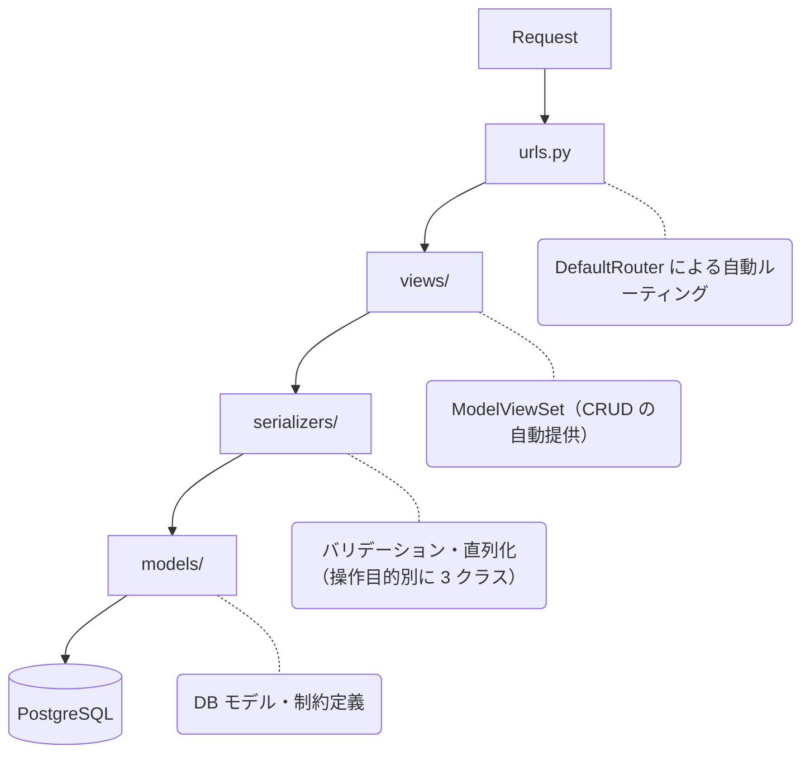

# Category CRUD API 設計仕様

## 概要

複数の企業（テナント）がそれぞれ独立したカテゴリ体系を管理するマルチテナント型の API を追加しました。
EC サイトや在庫管理システムにおける商品カテゴリを想定しており、企業をまたいだカテゴリの混在を許容しない設計を意識しています。

```
Company A                    Company B
  ├── 食品                     ├── 食品        ← 同名でも別企業なら OK
  │     ├── 野菜               └── 電化製品
  │     └── 肉・魚                   ├── スマートフォン
  └── 日用品                         └── PC
```

## エンドポイント

| メソッド | エンドポイント                   | 概要               |
| -------- | -------------------------------- | ------------------ |
| GET      | `/api/categories/`               | カテゴリ一覧取得   |
| POST     | `/api/categories/`               | ルートカテゴリ作成 |
| GET      | `/api/categories/{id}/`          | カテゴリ詳細取得   |
| PUT      | `/api/categories/{id}/`          | カテゴリ全更新     |
| PATCH    | `/api/categories/{id}/`          | カテゴリ部分更新   |
| DELETE   | `/api/categories/{id}/`          | カテゴリ削除       |
| POST     | `/api/categories/{id}/children/` | 子カテゴリ作成     |

- ルートカテゴリと子カテゴリの作成エンドポイントを分離している
- `POST /api/categories/` はルートカテゴリのみを作成し `parent_category` フィールドを持たない
- 子カテゴリは `POST /api/categories/{id}/children/` で作成し、`parent_category` は URL から自動セットされるためクライアントが指定できない

## アーキテクチャ

DRF の標準的な Layered Architecture に則り、既存コードの設計思想・命名規約・レイヤ分離のそれを踏襲する。



### シリアライザ構成

| クラス                    | 用途               | 概要                                                     |
| ------------------------- | ------------------ | -------------------------------------------------------- |
| `RootCategorySerializer`  | ルートカテゴリ作成 | `parent_category` フィールドなし                         |
| `ChildCategorySerializer` | 子カテゴリ作成     | `parent_category` は `read_only`（URL から自動セット）   |
| `CategorySerializer`      | 一覧・詳細・更新   | 全フィールドを持ち、クロスフィールドバリデーションを実装 |

### モデル設計の意図

既存モデルの設計意図はそのまま利用する。

| 設計                                  | 意図                                                                                                 |
| ------------------------------------- | ---------------------------------------------------------------------------------------------------- |
| UUID 主キー                           | Postgres で分散環境が前提                                                                            |
| 自己参照 FK（`parent_category`）      | 親削除時に子を孤立させず継続利用を許容                                                               |
| 複合ユニーク制約（`company`, `name`） | 同一企業内のカテゴリ名重複を DB レベルでも保証（前段の Serializer でも保証ロジックは組み込んでいる） |
| `related_name="+"`                    | 逆参照リレーションを無効化（意図しない N+1 クエリを回避）                                            |
| `db_comment` / `db_table_comment`     | DB スキーマ単体でも可読性を担保                                                                      |
| タイムスタンプの `editable=False`     | シリアライザ・フォームからの改ざんを防止                                                             |

## バリデーション

### DRF が自動で適用するバリデーション

| 対象                           | ルール                                                                    |
| ------------------------------ | ------------------------------------------------------------------------- |
| `name`                         | 必須・255 文字以内・空文字不可                                            |
| `company`                      | 必須・存在する UUID であること                                            |
| `parent_category`              | 任意・存在する UUID であること（nullable）                                |
| `(company, name)` の組み合わせ | 同一企業内で一意（モデルの `UniqueConstraint` を DRF が読み取り自動生成） |

### 独自バリデーション

| 条件                                                             | 対象操作      | ステータス |
| ---------------------------------------------------------------- | ------------- | ---------- |
| 空白のみの `name`（例: `" "`）                                   | 全操作        | 400        |
| 子カテゴリの `company` が親と異なる                              | children 作成 | 400        |
| `parent_category` が別企業に属している                           | PUT / PATCH   | 400        |
| カテゴリ自身を `parent_category` に設定（自己参照）              | PUT / PATCH   | 400        |
| 循環参照（A → B → A のようなループ）                             | PUT / PATCH   | 400        |
| PATCH で `company` 変更時の既存 `parent_category` との企業不一致 | PATCH         | 400        |

### エラーレスポンス例

```json
// 同企業内の重複名
{"non_field_errors": ["The fields company, name must make a unique set."]}

// 空白のみの name
{"name": ["カテゴリ名に空白のみは使用できません。"]}

// 別企業の親カテゴリ
{"parent_category": ["親カテゴリは同一企業に属している必要があります。"]}

// 自己参照
{"parent_category": ["カテゴリ自身を親カテゴリに設定することはできません。"]}

// 循環参照
{"parent_category": ["循環参照となる親カテゴリは設定できません。"]}
```

## 動作確認・コマンド

その他、セットアップ手順・curl コマンド例・テスト実行方法については [command.md](./commands.md) でまとめています。
